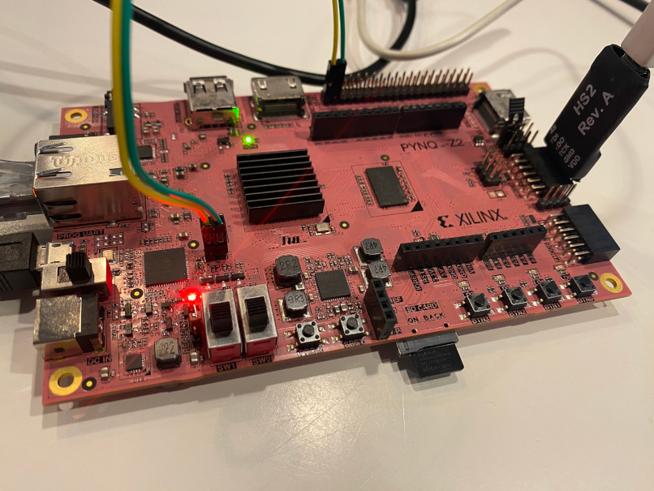

# NEORV32 - Pynq-Z2

This repository contains Vivado projects porting the NEORV32 test scripts (**bootloader** and **on-chip-debugger**) to the Pynq-Z2 FPGA board. It uses **NEORV32 v1.8.6**, which at this time is the only version compatible with the upstream version of Zephyr OS.

The designs have been tested with **Vivado 2020.2**. To create the projects simply run the following command from either folder:

```
vivado -source create_project.tcl &
```

The **bootloader** design uses a UART port connected to pins 40 (`TX`)) and 38 (`RX`) of the Raspberry Pi Header. Interfacing with the UART can be done through the FTDI chip of the Pynq-Z2 board, routing the signals from J13 using jumper wires as shown below. Note this only works if the PS is unused, otherwise the FTDI chip is used as `uart0` port in Vitis. Alternatively, you can use an external USB-TTL converter.

The **on-chip-debugger** extends the previous design with support for JTAG debugging. The JTAG signals (`TMS`, `TDI`, `TDO`, `TCK`) are mapped to the PMOD A connector (pins 1 to 4). To access the on-chip-debugger you can use e.g. a Digilent JTAG-HS2 Programming Cable as shown below. The folder contains an OpenOCD configuration file (`openocd_neorv32.cfg`) compatible with this device. It has been tested with **OpenOCD v0.12.0**.

In both designs the 8 GPIO interfaces are mapped to LEDs (normal and RGB). A clock generator module (`clkgen_pynqz2.sv`) is used to convert the internal 125 MHz to the 100 MHz clock signal as used in the reference examples. Note that the setup requires a cable present in the Ethernet connector to work correctly, otherwise the internal 125 MHz clock is not stable (see e.g. comments in this [thread](https://www.reddit.com/r/FPGA/comments/xbqphs/tul_pynqz2_zynq_development_board_has_anyone_used/)).



For more information about running the test setups (and the NEORV32 core in general) check the official documentation:

- [NEORV32 - User Guide](https://stnolting.github.io/neorv32/ug)
- [NEORV32 - Data Sheet](https://stnolting.github.io/neorv32) 